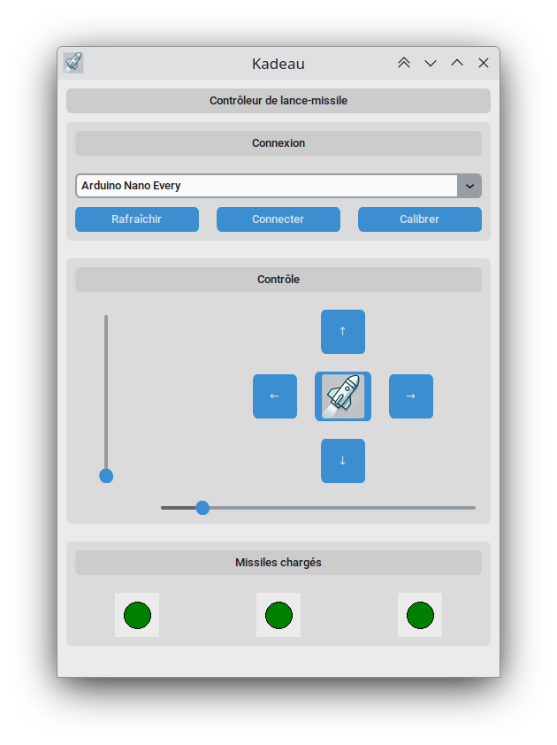

# Kadeau

Contrôleur de lance-missile pour [lance-missile USB](https://github.com/zetiti10/Lance-missile).



## Installation

Kadeau est un simple script python avec une interface graphique de contrôle du lance-missile. Pour l'exécuter, il est recommandé d'utiliser un environment virtuel python :

```bash
python -m venv /path/to/new/virtual/environment
```

Ensuite, il suffit d'installer les dépendances :

```bash
pip install -r requirements.txt
```

Enfin, exécuter le script :

```bash
.venv/bin/python Kadeau.py
```

> [!NOTE]
> L'interface graphique est gérée par `customtkinter`, et la liaison UART par `PySerial`.

## Utilisation

1. Une fois le lance-missile connecté, il faut choisir le port correspondant (le nom sera probablement "Arduino Nano Every).
2. Cliquer sur "Connecter".

> [!WARNING]
> Il peut être judicieux de cliquer sur Calibrer si le lance-missile est connecté a une source d'alimentation différente de sa dernière utilisation, car la vitesse pourrait être affectée, et donc le calcul de la position actuel erroné.

Il est possible de contrôler la position de la tête de trois manières différentes :

- Avec les boutons de direction
- Avec les deux curseurs (qui retournent dynamiquement la position de la tête)
- Avec les touches flèches du clavier, et la touche `Entrée` pour lancer un missile

> [!TIP]
> Attention à vos oreilles au lancement d'un missile !
